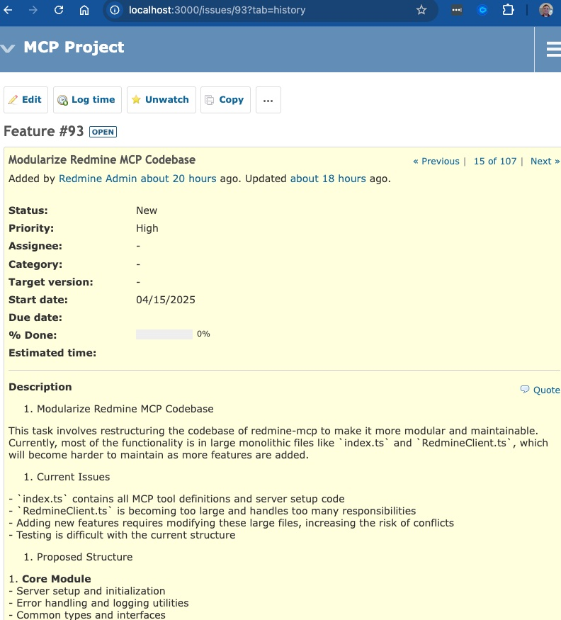
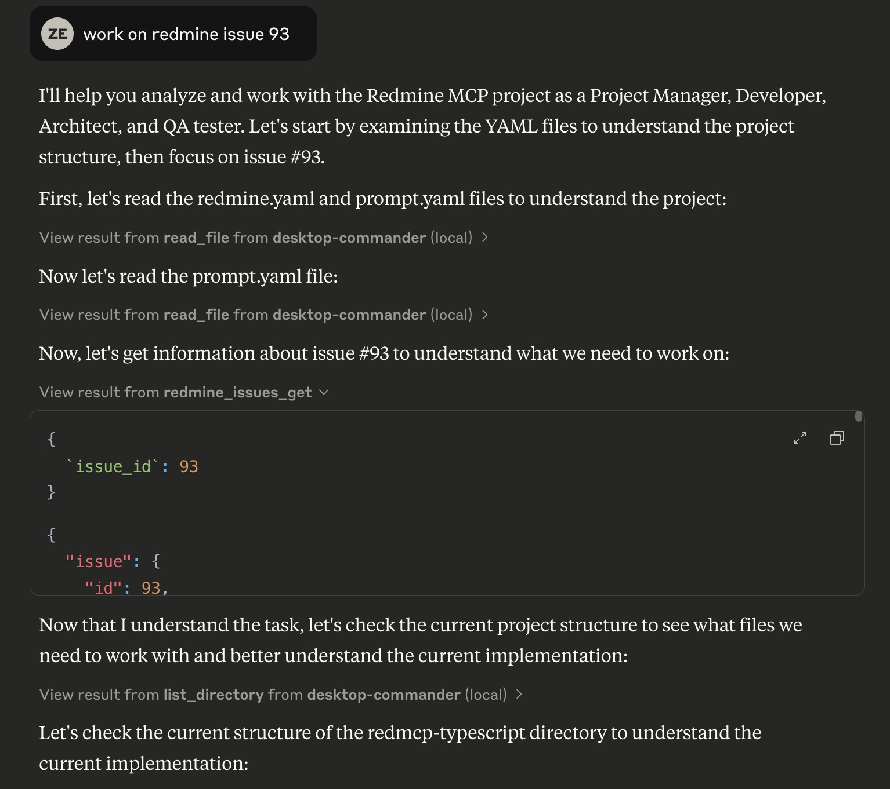

# Redmine MCP Server - Claude Integration

[Company in a Box](https://zacharyelston.github.io/RedmineMCP/)
Designed to breathe. 
Built to think. 
Yours to evolve.

An integration between Claude AI (or any MCP client - Like Windsurf) and Redmine using the Model Context Protocol (MCP).




## Overview
You can use the existing tooling like Jira MCP servers to accomplish this.  We disagree with Jira's structure and design as Redmine allows entire Projects to be shifted or rehomed without issue.  If you want an 100% OpenSource solution, keep reading.

The Redmine MCP project provides a seamless connection between Claude AI and Redmine project management system. It allows Claude to access and manipulate Redmine data through a TypeScript implementation of the Model Context Protocol.

This project represents a paradigm shift in how organizations structure collaboration between humans and AI. As described in our [NASCAR DevOps philosophy](./docs/nascar_devops.md), we've entered an era where "everyone's driving the same car" through standardized protocols like MCP. The difference now lies in the team—how humans and AI coordinate, communicate, and collectively solve problems.

By implementing this system, you're not just deploying a tool but creating a [Company in a Box](./docs/company-in-a-box/index.html)—a central nervous system where:

- AI agents handle routine operations while humans focus on strategy and creativity
- Work becomes visible, traceable, and continuously improvable
- Human value shifts from task execution to mentorship and process improvement
- Organizational knowledge persists beyond individual contributors
- Teams build a collective intelligence that compounds over time

The Redmine MCP integration transforms your organization into one where technology handles the routine, while humans focus on creativity, foresight, and meaning.

and NO - it's not 100% complete yet.  There is about - 90% more to go for full functionality and V2 will be where we start working on Modules.  So maybe jump in and help out. 

## Key Components

- **TypeScript MCP Server**: A robust implementation that connects Claude to Redmine
- **Redmine Development Environment**: A Docker-based Redmine setup for development and testing
- **CI/CD Integration**: GitHub and GitLab pipeline configurations with bi-directional sync
- **Comprehensive Documentation**: Guides and troubleshooting information

## Features

- **Project Management**: List and view Redmine projects with detailed information
- **Issue Tracking**: Create, update, list and view issues with full parameter support
- **Parent-Child Relationships**: Create and manage subtasks with hierarchical structure
- **Issue Relations**: Create, view, and manage issue relationships (relates, blocks, etc.)
- **User Information**: Access current user details and permissions
- **Robust Error Handling**: Detailed error reporting and parameter validation
- **Mock Mode**: Development and testing without requiring a Redmine instance

### Mock Mode Functionality

The mock mode feature allows for development, testing, and demonstrations without requiring an active Redmine instance. This is particularly valuable for:

- Offline development work
- Isolated testing environments
- Demonstrations and presentations
- Consistent and reproducible behaviors

The TypeScript implementation includes a complete mock data provider that simulates all Redmine operations with predictable responses.

## Quick Start

1. Clone this repository
2. Create a `.env` file with your Redmine API key (see `.env.example` in redmcp-typescript)
3. Navigate to `redmcp-typescript/` directory
4. Install dependencies with `npm install`
5. Build the project with `npm run build`
6. Start the server with `npm start`
7. Configure Claude Desktop to use the MCP server

## Project Structure

```
redmine-mcp/
├── .github/             # GitHub Actions workflows and configuration
├── docs/                # Project documentation
├── prompt.yaml          # MCP protocol configuration and tool definitions
├── redmcp-typescript/   # TypeScript implementation of the MCP server
├── redmine-server/      # Development environment with Docker setup
└── README.md            # This file
```

## MCP Server (redmcp-typescript)

The core of this project is the TypeScript implementation of the MCP server. It provides:

- Robust connection to Redmine API
- Type-safe parameter handling
- Comprehensive error management
- Full support for Redmine operations

For detailed information, see the [redmcp-typescript README](./redmcp-typescript/README.md).

## Development Environment

The project includes a Redmine development environment in the `redmine-server/` directory. This provides a consistent PostgreSQL database setup using Docker with:

- Predefined users with API keys
- Sample projects and issues
- Default configuration

To use the development environment:

1. Navigate to the `redmine-server/` directory
2. Run `docker-compose up -d` to start the environment
3. Use the predefined API keys for testing:

| User     | API Key                                  | Role      |
|----------|------------------------------------------|-----------|
| admin    | 7a4ed5c91b405d30fda60909dbc86c2651c38217 | Admin     |
| testuser | 3e9b7b22b84a26e7e95b3d73b6e65f6c3fe6e3f0 | Reporter  |
| developer| f91c59b0d78f2a10d9b7ea3c631d9f2cbba94f8f | Developer |
| manager  | 5c98f85a9f2e34c3b217758e910e196c7a77bf5b | Manager   |

## Available MCP Tools

### Project Operations
- `redmine_projects_list`: List all accessible projects
- `redmine_projects_get`: Get details of a specific project

### Issue Operations
- `redmine_issues_list`: List issues with optional filtering
- `redmine_issues_get`: Get details of a specific issue
- `redmine_issues_create`: Create a new issue
- `redmine_issues_update`: Update an existing issue

### Parent-Child Issue Operations
- `redmine_issue_create_subtask`: Create a subtask under a parent issue
- `redmine_issue_set_parent`: Set or change the parent of an existing issue
- `redmine_issue_remove_parent`: Remove parent relationship (make top-level)
- `redmine_issue_get_children`: Get all child issues of a parent

### Issue Relation Operations
- `redmine_issue_relations_get`: Get all relations for an issue
- `redmine_issue_relation_create`: Create a relation between issues
- `redmine_issue_relation_delete`: Delete an issue relation
- `redmine_issue_comment_add`: Add a comment to an issue

### User Operations
- `redmine_users_current`: Get current user information

For detailed parameter information, see the [redmcp-typescript README](./redmcp-typescript/README.md) and the [parent-child relationships documentation](./docs/parent-child-relationships.md).

## Integration with Claude Desktop

To use this MCP server with Claude Desktop, add the following configuration to Claude Desktop's configuration file:

- **macOS**: `~/Library/Application Support/Claude/claude_desktop_config.json`
- **Windows**: `%APPDATA%/Claude/claude_desktop_config.json`

```json
{
  "mcpServers": {
    "redmine": {
      "command": "node",
      "args": ["/absolute/path/to/redmcp-typescript/build/index.js"],
      "env": {
        "REDMINE_URL": "http://your-redmine-instance.com",
        "REDMINE_API_KEY": "your-api-key-here",
        "LOG_LEVEL": "info"
      }
    }
  }
}
```

Example configurations are available in the `redmcp-typescript/docs/` directory.

## Troubleshooting

For detailed troubleshooting steps and solutions, see the [TROUBLESHOOTING.md](./redmcp-typescript/TROUBLESHOOTING.md) file.

Common issues:
- Ensure your Redmine instance is accessible and the API key has appropriate permissions
- When creating issues, ensure the priority_id field is included (required by Redmine)
- Check Claude Desktop logs at `~/Library/Logs/Claude/` (macOS) for error messages

## Future Development

See [TODO.md](./redmcp-typescript/TODO.md) for planned enhancements and future development.

## CI/CD Integration

The project includes comprehensive CI/CD configurations for both GitHub Actions and GitLab CI:

### GitHub Workflows

Located in the `.github/workflows/` directory:

- **Main CI/CD Pipeline**: Mirrors the GitLab CI pipeline with install, lint, build, and test stages
- **GitLab Sync**: Automatically syncs changes from GitHub to GitLab
- **GitHub Sync**: Pulls changes from GitLab to GitHub on schedule or manual trigger

To use the GitHub workflows, the following secrets must be configured:
- `GITLAB_URL`: The URL of your GitLab repository
- `GITLAB_TOKEN`: GitLab Personal Access Token with repo write permissions
- `GITLAB_PROJECT_ID`: Your GitLab project ID
- `SYNC_GITHUB_TOKEN`: GitHub Personal Access Token for creating pull requests

### GitLab CI

The `.gitlab-ci.yml` pipeline includes:
- Dependencies installation
- Code linting
- Project building
- Automated testing
- Special test for subproject creation

For more details, see the [.github/README.md](./.github/README.md) file.

## Security Considerations

- API keys are stored separately in `.env` files
- Development API keys should never be used in production
- Always use secure connections (HTTPS) for production deployments
- CI/CD secrets should have minimal required permissions

## License

MIT
