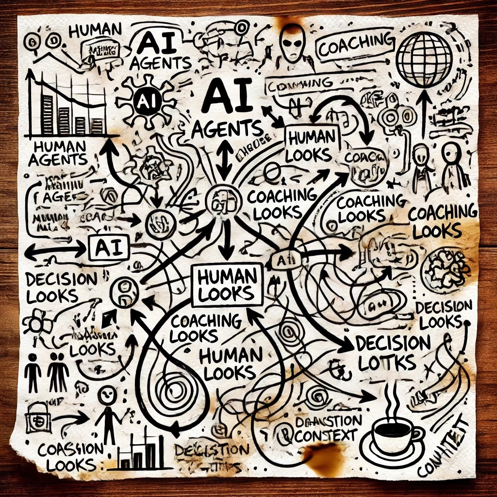

# Redmine MCP: The Company in a Box

## Reimagining Organizational Collaboration

The Redmine MCP server represents more than just a technical integration—it's a paradigm shift in how humans and AI systems collaborate within an organization. This document explores how this platform creates a "Company in a Box" that fundamentally transforms collaborative work.

## The Central Nervous System for AI-Human Teamwork

At its core, Redmine MCP provides a central hub where AI agents and their human counterparts converge, creating a unified workspace with clear visibility and structured communication. This isn't merely a task management tool—it's an organizational framework where:

- AI agents check in regularly, updating status and sharing insights
- Humans review, guide, and provide context to enhance AI understanding
- Work becomes visible, traceable, and improvable by the entire organization
- Cross-functional collaboration happens naturally through shared projects and interconnected issues

## Freedom Through Structure

By implementing Redmine MCP as your organizational backbone, you create a fascinating paradox—structured processes that unlock unprecedented creative freedom:

> "The Service is now automated and the reasoning and creative minds are free to imagine anything they want to build for the company, while everyone can see and review the work in a programmatic and pragmatic way."

This system automates routine service operations, documentation, and status tracking, allowing both humans and AI to focus on what they do best: creative problem-solving, innovation, and strategic thinking. When the mundane is automated, the extraordinary becomes possible.

## A New Paradigm for Human Contribution

Perhaps most revolutionary is how Redmine MCP transforms the nature of human work within an organization:

> "Human staff are now not judged on their speed or mastery of a single task, but rather by their ability to observe, teach, and improve through reason the process we are all a part of."

This shifts human value from task execution to process improvement, mentorship, and strategic oversight. Humans become guides, teachers, and systems thinkers who:

- Ask insightful questions that reframe problems
- Identify patterns across seemingly unrelated projects
- Provide critical context that shapes AI understanding
- Refine workflows and processes to enhance overall productivity
- Collaborate with AI to imagine and implement transformative solutions

## Building an Organizational Consciousness

When all work lives within a structured, accessible system like Redmine MCP, something remarkable emerges—a shared organizational consciousness where:

1. **Knowledge Persists**: Critical information is never lost with staff turnover
2. **Learning Compounds**: Insights from each project inform future work
3. **Patterns Emerge**: Systematic issues become visible across projects
4. **Innovation Accelerates**: Ideas can rapidly move from concept to implementation
5. **Quality Improves**: Review processes become collaborative rather than punitive

## Implementation Considerations

To truly achieve the "Company in a Box" vision with Redmine MCP:

1. **Cultural Onboarding**: Help human team members understand their evolved role
2. **Process Design**: Create workflows that leverage both human and AI strengths
3. **Feedback Loops**: Establish systems for continuous improvement of the platform itself
4. **Knowledge Management**: Develop conventions for documentation and information sharing
5. **Performance Metrics**: Redefine success measures to align with collaborative values

## Conclusion

The Redmine MCP server transcends its technical foundation to become a transformative organizational operating system. By providing a structured, visible, and collaborative environment where humans and AI agents work in harmony, it creates the conditions for unprecedented creativity, efficiency, and innovation.

In this new paradigm, technology handles the routine while humans focus on guidance, improvement, and imagination—truly embodying the concept of a "Company in a Box" where the best of human and artificial intelligence combine to create something greater than either could achieve alone.
